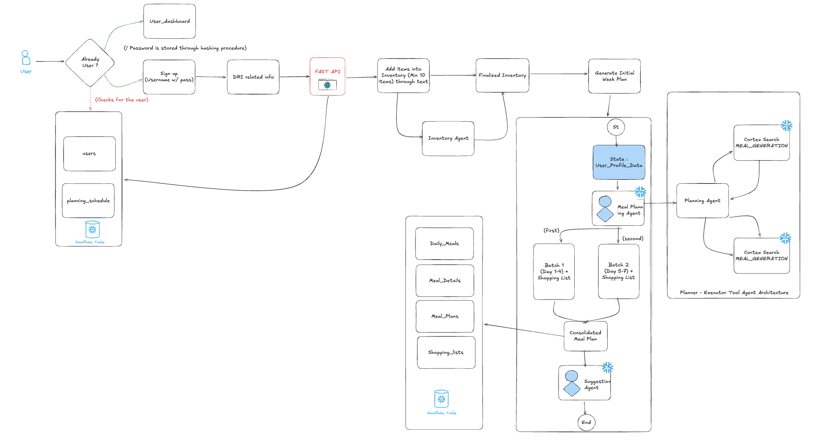
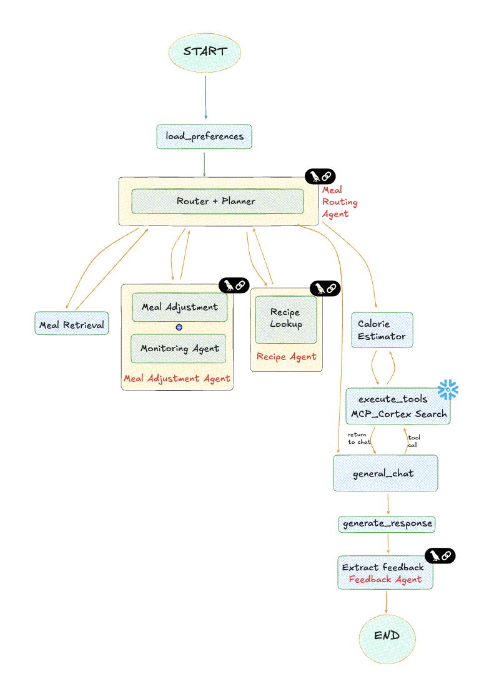
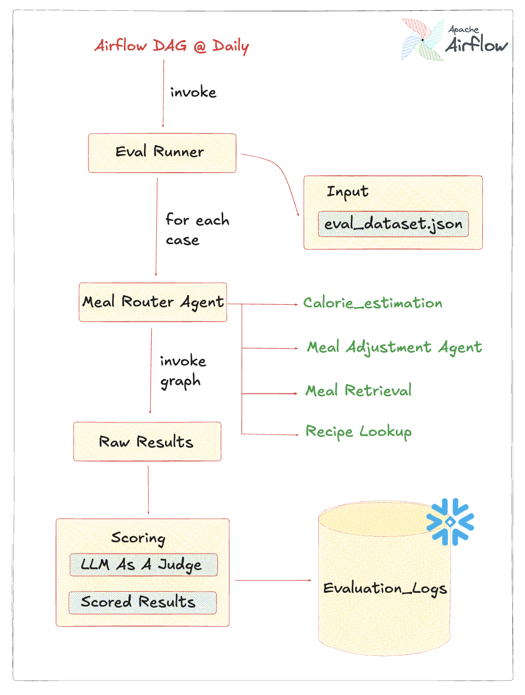
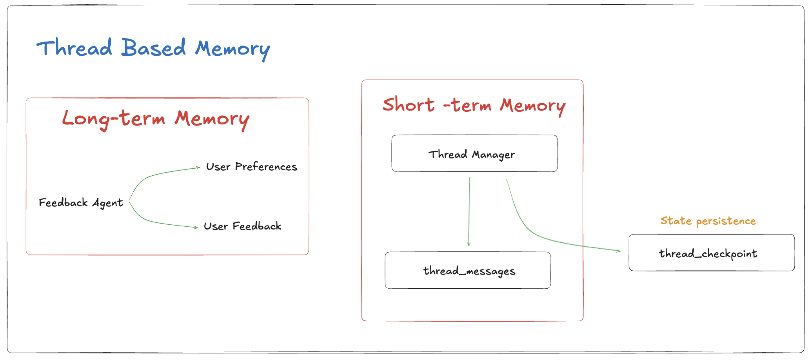
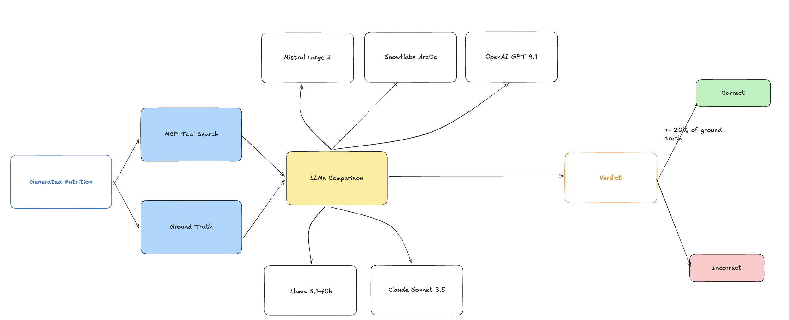
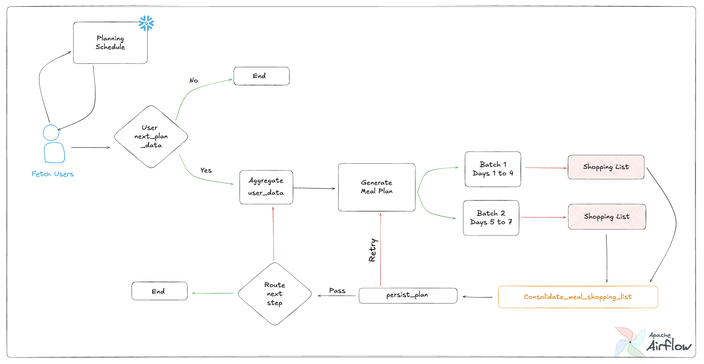

# 🍽️ Meal Mind - AI-Powered Nutrition Intelligence 

Meal Mind is a comprehensive Streamlit application designed to be your personalized meal planning assistant. **Proudly built entirely on Snowflake**, this application leverages the full power of the Data Cloud for secure storage, scalable compute, and advanced AI orchestration. Powered by Snowflake Cortex and USDA nutrition data, it helps you manage your diet, plan meals, track inventory, and generate shopping lists tailored to your specific nutritional needs and goals.

## ✍️ Authors

*   **Srinivasa Rithik Ghantasala**
*   **Vaishnavi Bhavesh Patel**
*   **Shanoo Raghav**

## 🌱 Project Evolution: 

Over the past 3 months, Meal Mind has evolved from a simple concept into a sophisticated, enterprise-grade AI application.

> **[📂 View Full Project Log (Google Drive)](https://docs.google.com/document/d/1k9SJ9u5VmLKNf1oUglRbQRno43me8Wr3awU9wtEtHug/edit?usp=sharing)**

## 🌟 Key Features 

*   **Personalized Nutrition Planning**: Calculates your daily caloric and macronutrient needs based on your age, gender, weight, height, activity level, and goals (Weight Loss, Maintenance, Muscle Gain).
*   **USDA Data Engineering Pipeline**: A robust, fully automated ELT pipeline that ingests, cleans, and transforms raw USDA nutrition data into analytics-ready insights using Snowflake and dbt, ensuring the most accurate nutritional information.
*   **AI-Driven Meal Generation**: Generates 7-day meal plans that fit your calculated nutritional profile.
*   **Smart Shopping List**: Automatically creates a consolidated shopping list based on your generated meal plan.
*   **Pantry Inventory Management**: Keep track of what you have at home to avoid overbuying and reduce food waste.
*   **Recipe Suggestions**: Get intelligent recipe suggestions based on ingredients you already have in your inventory.
*   **User Profiles**: Secure login and profile management to save your data and preferences.
*   **Dashboard**: A visual overview of your current stats, meal plan summary, and nutrition targets.

## 🛠️ Tech Stack

*   **Frontend**: [Streamlit](https://streamlit.io/) - For a responsive and interactive web interface.
*   **Backend Logic**: Python
*   **Database**: Snowflake (via `utils/db.py`) - For storing user data, meal plans, and inventory.
*   **API**: [RapidAPI Nutrition Calculator](https://rapidapi.com/blog/directory/nutrition-calculator/) - For fetching accurate DRI (Dietary Reference Intake) values.
*   **Authentication**: Custom secure authentication flow.
*   **Deployment**: **Snowflake Container Services (SPCS)** - The entire application is containerized and runs directly within Snowflake's secure boundary, ensuring data never leaves the platform.

## 📢 Project Poster

[📄 View Project Poster (PDF)](Images/MEAL%20MIND.pdf)

## 🧠 AI Models & Snowflake Cortex

This project proudly leverages **Snowflake Cortex** to access state-of-the-art Large Language Models (LLMs) securely and efficiently within the Data Cloud. By using Cortex, we ensure data privacy and low-latency inference.

**Models Used:**
*   **Meta Llama 3.1 70B**: For complex reasoning and meal plan generation.
*   **Anthropic Claude 3.5 Sonnet**: For high-quality natural language understanding and judging.
*   **Mistral Large 2**: For efficient task-specific processing.
*   **Snowflake Arctic**: For enterprise-grade tasks.
*   **OpenAI GPT-4.1**: For advanced conversational capabilities (integrated via Cortex).

## ❄️ Advanced Snowflake Integration

We leverage the full power of the Snowflake ecosystem to build a truly intelligent application:

*   **Snowflake Cortex Search**: We use Cortex Search to index and retrieve nutrition data with high semantic relevance. This enables Retrieval-Augmented Generation (RAG), allowing the AI to "know" the exact nutritional content of thousands of food items without hallucinating.
*   **Snowflake Cortex Analyst**: Empowering self-service analytics, Cortex Analyst allows users to ask natural language questions about their own data (e.g., "Show me my protein intake trend for the last month") and receive accurate, SQL-backed answers directly from the database.
*   **Model Context Protocol (MCP) Server**: A custom MCP server running on Snowflake acts as the bridge between our application and the data. It exposes specialized tools (like `search_foods`) that the AI agents can call securely, standardizing how our agents interact with external data and services.
*   **Snowflake Cortex Agents**: Our multi-agent system is built using **Snowflake Cortex Agents**. These agents are orchestrated to handle complex workflows—from planning weekly meals to adjusting recipes based on inventory—all while running securely within the Snowflake perimeter.


## 🛡️ Security, Privacy & Guardrails

Meal Mind prioritizes user safety and data privacy through a multi-layered security approach:

*   **Snowflake Cortex Guardrails**: All LLM interactions are filtered through Snowflake Cortex's built-in safety guardrails, ensuring that generated content is helpful, harmless, and honest. This prevents the generation of inappropriate or unsafe nutritional advice.
*   **PII Protection & Data Residency**:
    *   **Zero Data Exfiltration**: Since the app runs entirely within **Snowflake Container Services**, user data (PII) never leaves the secure Snowflake environment.
    *   **Secure Storage**: Sensitive information like passwords is cryptographically hashed (SHA-256) before storage.
    *   **RBAC**: Strict Role-Based Access Control ensures that only authorized services can access user data.

## 🏛️ Data Governance

We maintain strict data governance standards leveraging **Snowflake Horizon**:

*   **Unified Governance Model**: A single control plane for all data—structured (tables), semi-structured (JSON), and unstructured—ensuring consistent policy application.
*   **Data Lineage & Auditing**: Every transaction and transformation is trackable. We leverage Snowflake's Time Travel for data recovery and Query History for comprehensive auditing of all system interactions.
*   **Schema Evolution**: Our ELT pipelines (dbt) enforce schema contracts, ensuring data quality and consistency across the USDA nutrition datasets and user records.

## ⚙️ Data Engineering

The backbone of Meal Mind is a robust Data Engineering architecture designed for reliability and scale:

*   **Automated Pipelines (Airflow)**: We use **Apache Airflow** to orchestrate complex workflows, such as the weekly meal plan generation DAG. This ensures that every user gets their new plan on time, every time.
*   **ELT with dbt**: Raw data from the USDA API is loaded into Snowflake staging tables and then transformed into clean, analytics-ready models using **dbt (data build tool)**. This separation of concerns allows for rigorous testing and documentation of data transformations.
*   **Vector Search Optimization**: Food items are embedded and indexed to enable semantic search, allowing the AI to understand that "ground beef" and "minced meat" are semantically similar, improving recipe matching.


## 📂 Project Structure

```
meal_mind_streamlit/
├── Home.py                 # Main entry point of the application
├── .env                    # Environment variables (API keys)
├── admin_dashboard.py      # Admin dashboard for monitoring
├── meal_mind_dag.py        # Airflow DAG for automated meal planning
├── utils/                  # Utility functions and Agents
│   ├── agent.py            # Base agent definitions
│   ├── api.py              # API integration for nutrition data
│   ├── auth.py             # User authentication logic
│   ├── chat_agent.py       # Chat interface agent
│   ├── db.py               # Database connection and queries
│   ├── evaluation_agent.py # Agent for evaluating plans
│   ├── feedback_agent.py   # Agent for handling user feedback
│   ├── inventory_agent.py  # Agent for inventory management
│   ├── meal_adjustment_agent.py # Agent for adjusting meals
│   ├── meal_plan_workflow.py # Workflow orchestration
│   ├── meal_router_agent.py # Router for meal requests
│   ├── monitoring_agent.py # System monitoring agent
│   ├── onboarding.py       # Profile setup wizard
│   └── ui.py               # Custom CSS and UI components
├── views/                  # Application pages/views
│   ├── dashboard.py        # Main user dashboard
│   ├── inventory.py        # Pantry inventory management
│   ├── meal_plan.py        # Meal plan generation and display
│   ├── profile.py          # User profile settings
│   ├── shopping_list.py    # Automated shopping list
│   └── suggestions.py      # Recipe suggestions
├── evals/                  # Evaluation Framework
│   ├── eval_dataset.json   # Dataset for evaluation
│   ├── eval_runner.py      # Script to run evaluations
│   └── llm_judge.py        # LLM-based judge for quality assessment
└── tests/                  # Unit and integration tests
```

## 🤖 Agentic Architecture

Meal Mind leverages a sophisticated multi-agent architecture orchestrated by **LangGraph** and powered by **Snowflake Cortex**. This system ensures that every aspect of meal planning is handled by a specialized agent, resulting in highly personalized and accurate recommendations.

### Core Agents
*   **Meal Router Agent**: Acts as the entry point, analyzing user requests and routing them to the appropriate specialist agent.
*   **Meal Generation Agent**: The core engine that creates 7-day meal plans based on nutritional requirements and preferences.
*   **Inventory Agent**: Manages the user's pantry, tracking ingredients and suggesting recipes based on available stock.
*   **Meal Adjustment Agent**: Handles modifications to existing plans (e.g., "Swap Tuesday's lunch for a salad").
*   **Feedback Agent**: Learns from user feedback to improve future recommendations.
*   **Evaluation Agent**: continuously monitors the quality of generated plans against nutritional goals.

### Orchestration
The agents are orchestrated using a graph-based approach (LangGraph), allowing for complex workflows, state management, and conditional routing. This ensures that agents can collaborate effectively—for example, the Meal Generation Agent checks with the Inventory Agent to prioritize available ingredients.

## 🧠 Adaptive Intelligence & Long-Term Memory

Meal Mind isn't just a static planner; it evolves with you. Our system employs a sophisticated **Long-Term Memory** module that continuously refines its understanding of your preferences.

*   **Weekly Adaptive Planning**: Every week, the system generates a new meal plan not just based on nutrition, but by analyzing your history.
*   **Feedback Loop**: The **Feedback Agent** actively processes your ratings and comments (e.g., "I loved the spicy taco" or "Too much spinach").
*   **Preference Learning**: Over time, the system builds a detailed profile of your likes, dislikes, and dietary nuances, ensuring that each week's plan is more personalized and enjoyable than the last.


## 📊 Evaluation Framework

To ensure the reliability and quality of our AI recommendations, we have implemented a robust evaluation framework located in the `evals/` directory.

*   **LLM Judge (`llm_judge.py`)**: We use a high-capability LLM to act as an impartial judge, scoring generated meal plans against a set of criteria including nutritional accuracy, variety, and adherence to user constraints.
*   **Evaluation Dataset (`eval_dataset.json`)**: A curated dataset of diverse user profiles and edge cases used to benchmark system performance.
*   **Automated Runner (`eval_runner.py`)**: A script that executes the evaluation pipeline, running the agents against the dataset and aggregating scores from the LLM Judge.

This framework allows us to systematically measure improvements and catch regressions as we evolve the AI models.


## 🚀 Getting Started

### Prerequisites

*   Python 3.11 or lesser
*   A RapidAPI account (to get an API key for the Nutrition Calculator)

### Installation

1.  **Clone the repository** (if you haven't already):
    ```bash
    git clone https://github.com/ghantasala-sr/MealMind.git
    cd MealMind/meal_mind_streamlit
    ```

2.  **Create a virtual environment** (recommended):
    ```bash
    python -m venv .venv
    source .venv/bin/activate  # On Windows use: .venv\Scripts\activate
    ```

3.  **Install dependencies**:
    ```bash
    pip install streamlit requests pandas python-dotenv
    ```

4.  **Set up Environment Variables**:
    Create a `.env` file in the `meal_mind_streamlit` directory and add your RapidAPI & Snowflake credentials:
    ```env
    RAPIDAPI_KEY=your_rapidapi_key_here
    RAPIDAPI_HOST=nutrition-calculator.p.rapidapi.com
    SNOWFLAKE_USER= your_data
    SNOWFLAKE_USERNAME= your_data
    SNOWFLAKE_ACCOUNT= your_data
    SNOWFLAKE_PASSWORD= your_data
    SNOWFLAKE_WAREHOUSE= your_data
    SNOWFLAKE_DATABASE= your_data
    SNOWFLAKE_SCHEMA= your_data
    SNOWFLAKE_ROLE= your_data
    ```

### Running the App

Run the Streamlit application:

```bash
streamlit run Home.py
```

The app will open in your default web browser at `http://localhost:8501`.

## 📖 Usage Guide

1.  **Sign Up**: Create a new account with a username and password.
2.  **Profile Setup**: Complete the onboarding wizard to input your physical details and fitness goals.
3.  **Generate Meal Plan**: Go to the **Meal Plan** tab and click "Generate New Plan" to get a customized weekly menu.
4.  **Shop**: Check the **Shopping List** tab for a list of ingredients needed for your plan.
5.  **Manage Inventory**: Add items you already have to the **Inventory** tab to track your pantry.
6.  **Get Suggestions**: Visit **Suggestions** to find recipes you can make with your current inventory.

## 🏗️ System Architecture & Design

### System Architecture

The application follows a modern three-tier architecture with a Streamlit frontend, Python backend for business logic, and Snowflake as the data warehouse. This design ensures scalability, maintainability, and efficient data processing for nutrition intelligence.

### Data Flow & ELT Pipeline

Our Extract, Load, Transform (ELT) pipeline leverages Snowflake's computing power to process USDA nutrition data efficiently. Raw data is loaded into staging tables, then transformed using dbt models to create analytics-ready datasets for meal planning and nutritional analysis.

### User Onboarding Flow

The onboarding process is a structured journey designed to initialize the user's profile and pantry:
1.  **Authentication**: The system checks if the user exists. New users sign up, and their passwords are securely hashed before storage in the `users` table.
2.  **DRI Calculation**: Users input their physical details, which are sent to a **FastAPI** service to calculate their Dietary Reference Intake (DRI).
3.  **Inventory Initialization**: The user adds their initial pantry items (minimum 10) via text. The **Inventory Agent** processes this and populates the `Finalized Inventory`.
4.  **Initial Plan Generation**:
    *   The **Meal Planning Agent** triggers the **Cortex Search**-powered `MEAL_GENERATION` process.
    *   It generates the first week's plan in two batches (Days 1-4 and Days 5-7) to ensure high detail.
5.  **Consolidation**: The batches and generated shopping lists are consolidated and stored in Snowflake tables (`Daily_Meals`, `Meal_Details`, `Shopping_Lists`).
6.  **Suggestions**: Finally, the **Suggestion Agent** runs to offer immediate recipe ideas based on the newly added inventory.

### Agentic Workflow Orchestration

The core intelligence of Meal Mind follows a sophisticated orchestration flow powered by LangGraph:
1.  **Initialization**: The system starts by loading user preferences (goals, allergies, etc.) to ground every decision in the user's context.
2.  **Routing & Planning**: The **Meal Router Agent** acts as the central brain, analyzing the request and dispatching it to the appropriate specialist.
3.  **Specialized Execution**:
    *   **Meal Adjustment**: Modifies existing plans while monitoring for nutritional impact.
    *   **Recipe Lookup**: Fetches detailed recipe data.
    *   **Calorie Estimation**: Uses **Cortex Search** via the **MCP Server** to retrieve accurate nutritional data for any food item.
4.  **Response Generation**: The system synthesizes data from all tools and agents to generate a natural language response.
5.  **Feedback Loop**: Finally, the **Feedback Agent** extracts user sentiment to continuously refine future recommendations.

### Automated Evaluation Pipeline

To guarantee consistent quality, we run a daily automated evaluation pipeline using **Apache Airflow**:
1.  **Trigger**: The DAG runs daily, invoking the `Eval Runner`.
2.  **Test Cases**: It loads a diverse set of test scenarios from `eval_dataset.json`.
3.  **Agent Execution**: For each case, the **Meal Router Agent** is invoked, triggering the full graph of sub-agents (Calorie Estimation, Adjustment, Retrieval, etc.).
4.  **LLM-as-a-Judge**: The raw results are passed to a specialized **LLM Judge** (Claude 3.5 Sonnet) which scores the response against strict criteria.
5.  **Logging**: All scores and traces are logged directly to **Snowflake** tables (`Evaluation_Logs`) for long-term trend analysis and regression testing.

### Thread-Based Memory Architecture

To maintain context and personalization, Meal Mind employs a dual-memory system:
*   **Long-term Memory**: Managed by the **Feedback Agent**, this persists high-level user data such as **User Preferences** (dietary restrictions, goals) and **User Feedback** (likes/dislikes) to ensure the system evolves with the user.
*   **Short-term Memory**: Handles the immediate conversational context. The **Thread Manager** orchestrates `thread_messages` for active dialogue and maintains `thread_checkpoints` for state persistence, allowing users to pause and resume planning sessions seamlessly.

### RAG & LLM Evaluation Pipeline

We ensure the accuracy of our AI's nutritional claims through a rigorous **RAG-based Evaluation Pipeline**:
1.  **Generation**: The system takes the "Generated Nutrition" output from the agents.
2.  **Ground Truth Retrieval**: It simultaneously uses **MCP Tool Search** (powered by Cortex Search) to fetch the official USDA data for the same food items.
3.  **LLM Comparison**: A panel of state-of-the-art models (Mistral Large 2, Snowflake Arctic, GPT-4, Llama 3.1, Claude 3.5) compares the generated values against the ground truth.
4.  **Verdict**: The system assigns a verdict of **Correct** if the generated values are within a **±20% tolerance** of the ground truth, or **Incorrect** otherwise. This multi-model consensus ensures that no single model's bias affects the quality score.

### Weekly Meal Plan Generation Pipeline

The heart of our automation is the **Airflow-orchestrated Weekly Planner**:
1.  **Scheduling**: The system continuously monitors the `Planning Schedule` in Snowflake to identify users due for a new plan (`next_plan_date`).
2.  **Data Aggregation**: For eligible users, it aggregates all relevant context: profile data, current inventory, and past feedback.
3.  **Batch Generation**: To handle context window limits and ensure detail, the 7-day plan is generated in two parallel batches:
    *   **Batch 1**: Days 1 to 4
    *   **Batch 2**: Days 5 to 7
4.  **Shopping List Creation**: A shopping list is generated for each batch immediately.
5.  **Consolidation & Persistence**: The batches and lists are consolidated into a single coherent plan and persisted to the database (`persist_plan`). If any step fails, the system includes automatic retry logic to ensure reliability.


## 🤝 Contributing

Contributions are welcome! Please feel free to submit a Pull Request.


## 📄 License

[MIT License](LICENSE)
